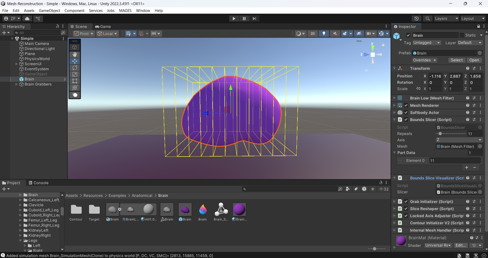
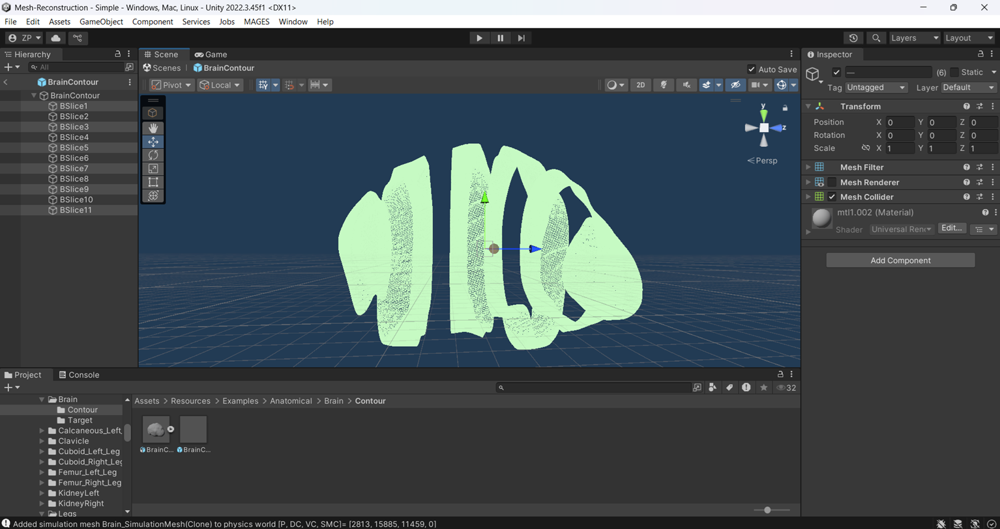
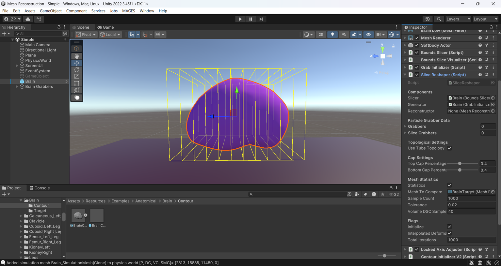
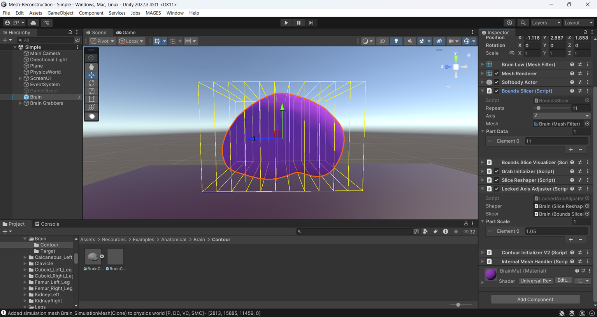
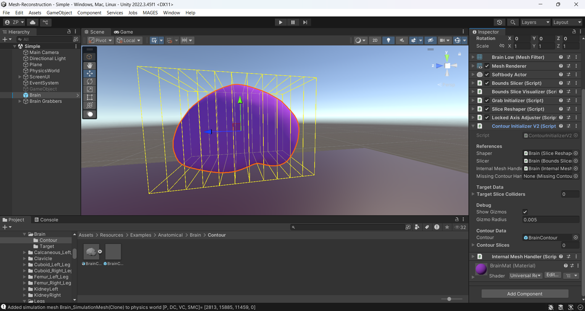

# Mesh Reconstruction - Mesh deformations using XR-PBD To create patient specific models for medical XR applications

[](https://unity.com/)
[](https://opensource.org/licenses/MIT)

## Overview
Mesh Reconstruction is a procedural geometry pipeline designed for **Extended Reality** (XR) medical simulations. It bridges the gap between raw clinical DICOM data and real-time physics engines. Instead of relying on excessively dense Marching Cubes reconstructions, this tool utilizes **Centroid-Directed Ray Casting** and **Barycentric Interpolation** to morph pre-optimized, physics-ready anatomical templates into **Patient-Specific** models.

**Key Features:**
* A novel pipeline that deforms initial anatomical 3D models into **Patient-Specific** ones.
* Uses models with optimized topology, so that performance is above acceptable VR thresholds.
* Mathematically fills any gaps created from missing clinical data using **Bezier Curves**.

---

## Visual Results
Below is a visual demonstration of the pipeline in action, showing an optimized initial model being deformed to perfectly match the contours of a patient-specific anatomy.

| Initial Model | Patient-Specific Model |
| :---: | :---: |
|  |  |

> **Note:** The initial model (left) features a highly optimized vertex count, allowing the final patient-specific model (right) to maintain the exact same topological footprint while matching the true clinical contours.

---

## Getting Started

### Prerequisites
* **Unity Version:** 2022.3.45
* **Dependencies:** MAGES NXT, XR-PBD package from MAGES NXT

### Running the Pre-Built Examples
Because this pipeline relies on the experimental XR-PBD physics engine, setting up an example requires a few specific reference assignments before entering Play mode. Follow these steps to run the ready-made patient cases included in the repository:

### Phase 1: Scene and Prefab Setup
Open the Project: Clone or download this repository and open it in Unity.

⚠️ Important: If the Unity Editor prompts you to update Mages NXT, decline the update. Updating may cause unexpected physics behaviors.

Open the Base Scene: Navigate to `Assets/Scenes` and open the Simple.unity scene.

Choose an Example: Navigate to `Assets/Resources/Examples`. Here you will find two subfolders:

* **Anatomical**: Contains standard patient cases (e.g., Brain, Femur).

* **MissingDataExamples**: Contains test cases where up to 15% of the mapping data is intentionally missing.

Instantiate the Prefab: Drag and drop your chosen example prefab (e.g., the Brain) into your scene hierarchy. This prefab contains all the necessary pipeline components (Bounds Slicer, Slice Reshaper, etc.).


### Phase 2: Physics and Grabber Initialization
Assign the **Physics World**: Select your newly instantiated example prefab in the hierarchy. In the Inspector, locate the **Softbody Actor** component. Drag and drop the *Physics World* GameObject (already present in the Simple.unity scene) into the corresponding field on this component.


Open the Grabber Tool: From the top Unity menu, navigate to `Window > Particle Grab Generator`.

Generate Grabbers: In the generator window, assign your example prefab to the `Object from the scene` field.

Assign the Grab.prefab (located in `Assets/Resources/extra`) to the target field.

Finally, Assign the `Physics World` to the Physics World field.

Note: Ensure there are no leftover Grabber GameObjects overlapping with your model in the scene before proceeding.

Click the button to generate the particle grabbers.


### Phase 3: Runtime Execution
Enter Play Mode: Press the Play button at the top of the Unity Editor.

Select the Anatomy: In the Game View UI, use the dropdown menu to select the deformable object you just set up.

Reconstruct: Click the Reconstruct button in the UI. Watch as the pipeline executes the ray cast mapping and morphs the template to the target contours in real-time!

Save (Optional): If your prefab has a Mesh Reconstruction component attached, you can click the Save button in the UI to serialize and export the newly deformed patient-specific mesh to your project files.


---

## Setting Up a Custom Example (From Scratch)
You can easily apply this pipeline to your own templates and contour datasets. Follow these steps to set up a new example:

### 1. Import Your Assets
Import your initial 3D template and its corresponding Simulation Mesh into your Unity project assets.

💡 Note: Ensure your simulation mesh settings are specifically optimized for soft-body physics before proceeding.

### 2. Bounds Slicer
Select your initial model in the scene hierarchy and attach the **Bounds Slicer** and **Bounds Slice Visualizer** components to it.

Assign all necessary references in both inspectors.

Set the Repeats field to match the exact number of contours contained in your patient dataset.

Set the Axis parameter based on the spatial orientation of your target clinical cuts.

Populate the Parts Data table, ensuring it contains at least one segment matching your total contour count. The Bounds Slice Visualizer will automatically project the slice planes onto the model in the Scene view.

| Bounds Slice Visualizer | Contour Data |
| :---: | :---: |
|  |  |

### 3 Attach the Pipeline Controller
Attach the Slice Reshaper Controller script to the initial model's GameObject. This action will automatically append the required Grab Initializer dependency script.

Configure your target deformation parameters in the inspector.

Ensure that the Initialize flag is checked (true).

Optional Evaluation: If you have an explicit ground-truth model of the patient's anatomy to test against, check the Statistics flag and assign it to the Mesh to Compare field. The pipeline will dynamically output your final mathematical similarity score at runtime.



### 4 Additional components

Add the **Locked Axis Adjuster** component which is responsible for scaling the object on the axis the contours were cut.



Add the **Contour Initializer** component, the component important for executing the main **Mapping algorithm**



Finally, Add the **Internal Mesh Handler** component, responsible for the edges of the model.

### 5 Missing Contour Handler.

If your clinical dataset suffers from corrupted, incomplete, or missing contour sections, attach the Missing Contour Handler component to the model. Once added, ensure you drag and drop this component into the corresponding reference slot on your Contour Initializer script. The pipeline will automatically scan for geometric gaps and deploy the Bézier interpolation solver at runtime.

### 6 Configure Mapping Settings

Before hitting play, adjust the execution parameters on the components to optimize the surface mapping behavior:

Bezier Power for Missing Data: Configures the outward curvature (bulge) of the interpolation path bridging missing geometry gaps.

Barycentric Cap %: Located within the Slice Reshaper Controller. Defines the physical percentage of the model's distal edges that will bypass ray casting and instead utilize Barycentric mapping to eliminate mesh tearing artifacts.

### 7. Execute
Press Play in the Unity Editor. Use the custom editor dropdown to select your object and click Reconstruct.

🛠️ Debugging Tip: Keep the scene view open during execution. The pipeline's built-in debug gizmos will draw the real-time ray cast trajectories, perimeters, and interpolation curves so you can visually audit the algorithm's math before finalizing the static mesh.

---

## Documentation and Implementation Details
This README focuses on usage and results. For a deep dive into the mathematical implementation, ray cast logic, and missing data handling, please refer to the fully commented C# scripts within the `Assets/Scripts` folder, or read the full thesis report here: [Link to PDF if applicable].

## Citation
If you use this pipeline in your research, please cite:
```bibtex
@mtzpdef{zpdeform2026,
  author  = {Ziotas Paul},
  title   = {Mesh deformations using XR-PBD To create patient specific models for medical XR applications},
  school  = {University of Crete},
  year    = {2026}
}
