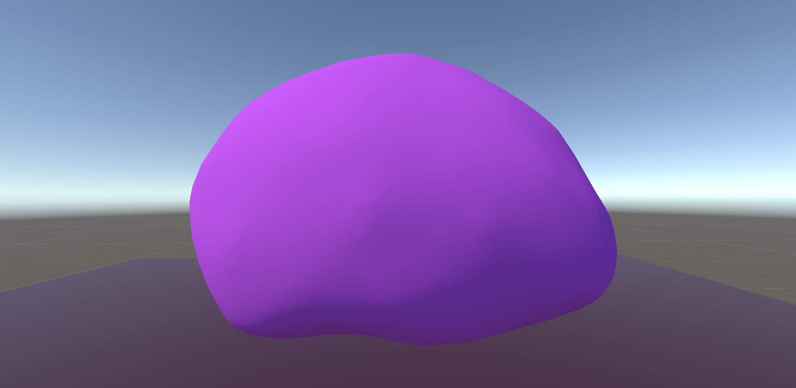
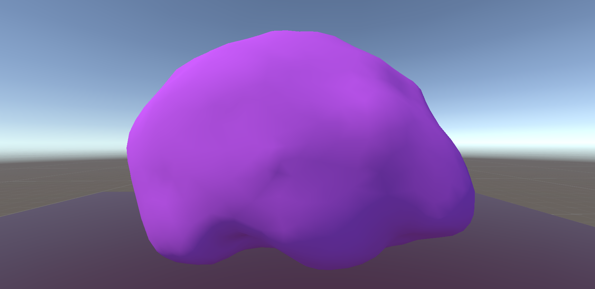
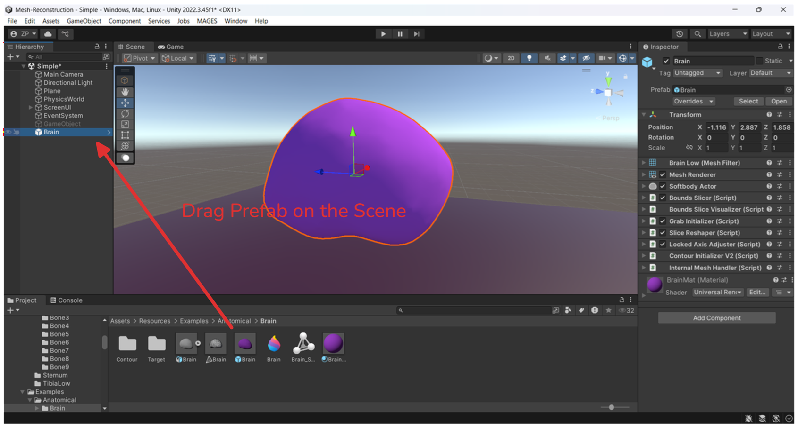
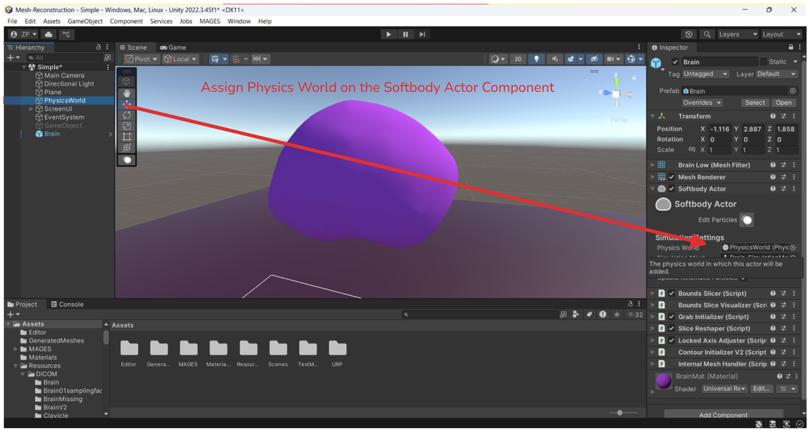
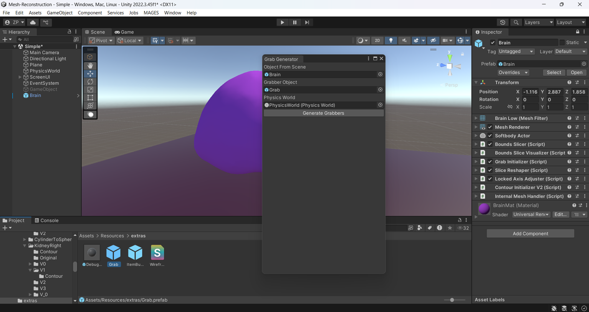
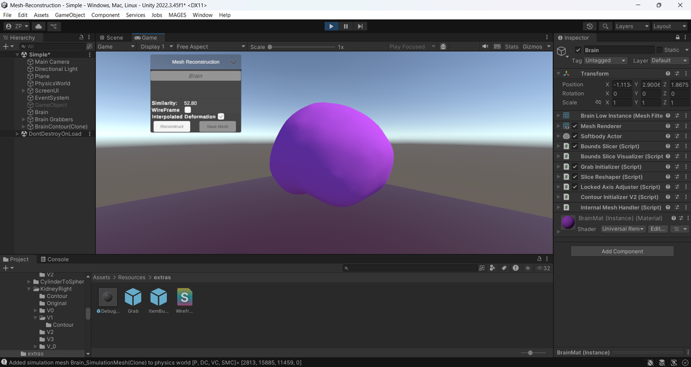

# Mesh Reconstruction - Mesh deformations using XR-PBD To create patient specific models for medical XR applications

[](https://unity.com/)
[](https://opensource.org/licenses/MIT)

## Overview
Mesh Reconstruction is a procedural geometry pipeline designed for **Extended Reality** (XR) medical simulations. It bridges the gap between raw clinical DICOM data and real-time physics engines. Instead of relying on excessively dense Marching Cubes reconstructions, this tool utilizes **Centroid-Directed Ray Casting** and **Barycentric Interpolation** to morph pre-optimized, physics-ready anatomical templates into **Patient-Specific** models.

**Key Features:**
* Low memory footprint (sub-4MB) ideal for XR soft-body physics (e.g., XR-PBD).
* Maintains consistent `< 3,000` vertex topologies.
* Mathematically handles up to 20% missing clinical data via Quadratic Bézier interpolation.

---

## Visual Results
Below is a visual demonstration of the pipeline in action, showing an optimized initial model being deformed to perfectly match the contours of a patient-specific anatomy.

| Initial Model | Patient-Specific Model |
| :---: | :---: |
|  |  |

> **Note:** The initial model (left) features a highly optimized vertex count, allowing the final patient-specific model (right) to maintain the exact same topological footprint while matching the true clinical contours.

---

## Getting Started

### Prerequisites
* **Unity Version:** 2022.3.45
* **Dependencies:** MAGES NXT, XR-PBD package from MAGES NXT

### Running the Pre-Built Examples
Because this pipeline relies on the experimental XR-PBD physics engine, setting up an example requires a few specific reference assignments before entering Play mode. Follow these steps to run the ready-made patient cases included in the repository:

### Phase 1: Scene and Prefab Setup
Open the Project: Clone or download this repository and open it in Unity.

⚠️ Important: If the Unity Editor prompts you to update Mages NXT, decline the update. Updating may cause unexpected physics behaviors.

Open the Base Scene: Navigate to `Assets/Scenes` and open the Simple.unity scene.

Choose an Example: Navigate to `Assets/Resources/Examples`. Here you will find two subfolders:

* **Anatomical**: Contains standard patient cases (e.g., Brain, Femur).

* **MissingDataExamples**: Contains test cases where up to 15% of the mapping data is intentionally missing.

Instantiate the Prefab: Drag and drop your chosen example prefab (e.g., the Brain) into your scene hierarchy. This prefab contains all the necessary pipeline components (Bounds Slicer, Slice Reshaper, etc.).



### Phase 2: Physics and Grabber Initialization
Assign the **Physics World**: Select your newly instantiated example prefab in the hierarchy. In the Inspector, locate the **Softbody Actor** component. Drag and drop the *Physics World* GameObject (already present in the Simple.unity scene) into the corresponding field on this component.



Open the Grabber Tool: From the top Unity menu, navigate to `Window > Particle Grab Generator`.

Generate Grabbers: In the generator window, assign your example prefab to the `Object from the scene` field.

Assign the Grab.prefab (located in `Assets/Resources/extra`) to the target field.

Finally, Assign the `Physics World` to the Physics World field.

Note: Ensure there are no leftover Grabber GameObjects overlapping with your model in the scene before proceeding.

Click the button to generate the particle grabbers.



### Phase 3: Runtime Execution
Enter Play Mode: Press the Play button at the top of the Unity Editor.

Select the Anatomy: In the Game View UI, use the dropdown menu to select the deformable object you just set up.

Reconstruct: Click the Reconstruct button in the UI. Watch as the pipeline executes the ray cast mapping and morphs the template to the target contours in real-time!

Save (Optional): If your prefab has a Mesh Reconstruction component attached, you can click the Save button in the UI to serialize and export the newly deformed patient-specific mesh to your project files.



---

## Setting Up a Custom Example (From Scratch)
You can easily apply this pipeline to your own templates and contour datasets. Follow these steps to set up a new example:

### 1. Import Your Assets
Import your initial 3D template into the scene and initialize

### 2. Attach the Pipeline Controller
Create an empty GameObject and attach the `Bounds Slicer`, `Bounds Slice Visualizer` component to it.


*Caption: The main controller script attached to a GameObject.*

### 3. Assign References
In the Unity Inspector, assign your initial template to the **[Insert Field Name]** slot, and drop your contour data into the **[Insert Field Name]** array.


*Caption: Dragging and dropping the template and contours into the script.*

### 4. Configure Mapping Settings
Adjust the parameters for the deformation:
* **Missing Data Tolerance:** Set how the pipeline handles gaps.
* **Barycentric Cap %:** Define the percentage of the distal ends to be mapped using Barycentric coordinates to prevent artifacting.


*Caption: Configuring the Bézier and Barycentric parameters.*

### 5. Execute
Press **Play** in the editor. You can use the provided debug gizmos to visually verify the ray cast trajectories and interpolation curves in the Scene view before finalizing the mesh!

---

## Documentation and Implementation Details
This README focuses on usage and results. For a deep dive into the mathematical implementation, ray cast logic, and missing data handling, please refer to the fully commented C# scripts within the `Assets/Scripts` folder, or read the full thesis report here: [Link to PDF if applicable].

## Citation
If you use this pipeline in your research, please cite:
```bibtex
@mtzpdef{zpdeform2026,
  author  = {Ziotas Paul},
  title   = {Mesh deformations using XR-PBD To create patient specific models for medical XR applications},
  school  = {University of Crete},
  year    = {2026}
}
